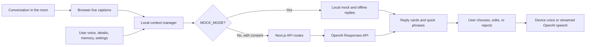

# Cadence

**Cadence helps people with ALS and other AAC users stay part of a live conversation.**

When someone speaks, Cadence listens, prepares a few short replies in the user's voice, and makes them ready to speak with one tap. The user can also correct the context, hold their turn, express a need, or start a topic themselves.

## Impact Thesis

**The potential impact is not just faster text entry. It is helping a person be heard in the live moment, stay the author of their words, and initiate what matters to them.**

Cadence is designed around four moments that can otherwise be lost in a fast conversation: responding before the topic changes, repairing a misunderstanding, expressing an essential need, and starting a conversation instead of only reacting.

> Cadence is an early assistive communication prototype. It is not a medical device, emergency tool, or replacement for an AAC assessment, speech-language pathologist, or care plan.

## The Problem

Conversation moves faster than many AAC systems can be operated. Even a thoughtful message can arrive after the subject has changed. That can turn a group conversation into something a person only reacts to from the edge.

Cadence is built around a different goal: **make the user's next turn ready before the moment passes.**

- It prepares several grounded choices, not one forced answer.
- It keeps every spoken word under the user's control.
- It supports starting a conversation, not only replying.
- It keeps essential communication available when the network or model is unavailable.

**What is different:** many tools help compose a message faster. Cadence is a live conversation layer that helps a person respond, repair a misunderstanding, hold the floor, and initiate in their own voice.

## What a Person Can Do

| In the moment | How Cadence helps |
| --- | --- |
| Someone says something | Shows captions and prepares 3 to 4 reply options. |
| A reply feels right | Tap it to preview or speak it, then make it shorter, more like the user, saved, or rejected. |
| A caption or reply is wrong | Use **Wrong context**, edit the caption, rename the speaker locally, or use editable repair phrases such as “Please repeat that.” |
| The user needs time | Tap **Hold the floor** for a natural floor-holding phrase. |
| The user has a need | Open **My needs** for editable care, comfort, and urgency phrases. A local help reminder can point to an existing plan, but Cadence never sends an alert. |
| The user wants to lead | Choose **Start something** for user-led conversation openers. |
| The user wants their wording respected | Use **Conversation setup** to choose a language and preserve wording without automatic translation or normalization. |
| Internet is down | Use saved replies, needs, feelings, repair phrases, the backup board, and device voice. |

## Why It Matters

Many people with ALS eventually lose functional speech. AAC can be life-changing, but adoption can be affected by training time, fatigue, access method fit, and communication-partner support. Cadence is designed to reduce the pressure of live conversation without taking authorship away from the user.

| Common barrier | Cadence response |
| --- | --- |
| A long learning curve | Ready-to-tap replies, plain-language onboarding, and contextual help. |
| High effort or eye-gaze fatigue | Large targets, low-effort quick phrases, and adjustable single-switch scanning. |
| Partner-training burden | Conversation partners need no special app or account. A short optional guide helps them pause and leave authorship with the AAC user. |
| Loss of agency | User-led openers, personal voice, editing, rejection, and context repair. |
| A service or connection failure | Local fallback replies, device speech, a backup board, and saved essentials. |

Background reading: [ALS speech loss](https://pubmed.ncbi.nlm.nih.gov/37760880/), [AAC fit and support](https://pmc.ncbi.nlm.nih.gov/articles/PMC6924798/), [AAC abandonment research](https://pubmed.ncbi.nlm.nih.gov/17114167/), and [eye-gaze AAC in ALS](https://pmc.ncbi.nlm.nih.gov/articles/PMC11530652/).

Cadence does not claim clinical effectiveness. The next validation step is voluntary testing with AAC users, family members, caregivers, and speech-language pathologists.

## Research-Informed Design

Cadence is informed by publicly available research and guidance. These sources shaped the design priorities below. They do not validate Cadence itself, and Cadence does not reproduce their text, figures, branding, datasets, or participant data.

See [UX and performance research notes](docs/UX-PERFORMANCE-RESEARCH.md) for the current lightweight runtime budget, eye-gaze safeguards, and the design review checklist.
See [competitive landscape and source boundaries](docs/COMPETITIVE-LANDSCAPE.md) or the public [research and sources page](/research) for a plain-language comparison with established AAC, predictive text, personal voice, atypical-speech, and dedicated eye-gaze solutions.

| Public source | Design insight used | Cadence response |
| --- | --- | --- |
| [ASHA AAC Practice Portal](https://www.asha.org/practice-portal/professional-issues/augmentative-and-alternative-communication/) | AAC use depends on the person, access method, environment, and communication partners. | Large targets, switch scanning, personal setup, conversation kits, and a partner-friendly live flow. |
| [AAC abandonment study](https://pubmed.ncbi.nlm.nih.gov/17114167/) | Adoption can be limited by effort, training, support, and fit. | One-tap staged choices, short onboarding, local phrase editing, and no required partner app or account. |
| [AAC fit and support study](https://pmc.ncbi.nlm.nih.gov/articles/PMC6924798/) | Communication technology must fit real goals and daily contexts. | Personal voice, details, boundaries, saved kits, needs, feelings, and user-led openers. |
| [Eye-gaze AAC in ALS study](https://pmc.ncbi.nlm.nih.gov/articles/PMC11530652/) | Access effort and fatigue matter in ALS communication. | Minimal taps, configurable scanning, fast quick phrases, hold-the-floor, and offline backup access. |
| [ALS speech analysis study](https://pubmed.ncbi.nlm.nih.gov/37760880/) | Speech changes and speech loss are significant parts of ALS progression. | Captions plus user-controlled text-to-speech, with no requirement that the user speak to use Cadence. |
| [Google SpeakFaster paper](https://research.google/pubs/using-large-language-models-to-accelerate-communication-for-eye-gaze-typing-users-with-als/) | Language models can reduce interaction effort for AAC communication. | Diverse structured reply choices, style-guided wording, and an internal tap-savings metric with a non-comparability caveat. |
| [W3C WCAG 2.2](https://www.w3.org/TR/WCAG22/) | Target size, visible focus, keyboard operation, and clear status feedback are essential access requirements. | Large controls, focus rings, modal focus trapping, Escape support, keyboard navigation, live announcements, and responsive layouts. |
| [Inclusive AAC UI co-design study](https://pubmed.ncbi.nlm.nih.gov/39868412/) | Iterative co-design can reveal access barriers that designer-only work misses. | Voluntary AAC-user, caregiver, and SLP feedback is a required validation step, not a claimed result. |
| [AAC partner-instruction meta-analysis](https://www.tandfonline.com/doi/full/10.3109/07434618.2015.1052153) | Conversation partners can affect AAC communication outcomes. | A compact partner guide: no partner app or account, speak to the person, pause, and let the person decide. |
| [ASHA multilingual service guidance](https://www.asha.org/practice-portal/professional-issues/multilingual-service-delivery/) | Communication assessment and support should consider linguistic and cultural context. | Device-local language choice and a preserve-wording setting. Cadence does not intentionally translate or normalize a person's dialect or code-switching. |
| [Voice banking and identity in MND](https://pubmed.ncbi.nlm.nih.gov/33350040/) | Voice choices can be tied to identity and deserve personal control. | User-selectable speech voice and conversation kits that can retain a preferred voice. Cadence does not claim voice cloning. |
| [ALS participation study](https://pubmed.ncbi.nlm.nih.gov/38837773/) | Communication impact is broader than raw speed. | Local participation signals for reply time, initiated topics, edits, rejections, and whether a reply sounded like the person. |

### Responsible use of research

- We link to original public sources instead of copying substantial text or visual material.
- We describe design inspiration, not clinical outcomes or endorsements.
- We do not claim Cadence is superior to another product without comparable testing.
- The SpeakFaster result is cited as context only. Cadence's local tap estimate uses a different method and is not a benchmark comparison.
- Real usability feedback and accessibility testing remain necessary before broad public or clinical claims.

## Future Prospects

These are research-informed directions, not current product claims. They require participatory design, accessibility review, and reliable implementation before release.

| Direction | Why it matters | What must happen first |
| --- | --- | --- |
| Participatory co-design | AAC users, family members, caregivers, and speech-language professionals can expose barriers that a developer-only process misses. | Run voluntary, consent-based sessions; document findings; iterate with participants. |
| Stronger multilingual and cultural support | A person should be able to keep their language, dialect, and code-switching without unwanted normalization. | Expand language coverage with community review and language-specific testing. |
| Voice identity options | A familiar or preferred speaking voice can be identity-sensitive. | Add only consent-based voice options with clear ownership, privacy, and safety controls. |
| More reliable eye-gaze access | Camera gaze should reduce effort, not introduce fatigue or false selections. | Test target-based calibration, dwell settings, stability, and fatigue with real users; keep the feature beta until then. |
| Better participation outcomes | A useful system should improve agency, repair, connection, and comfort, not only reduce taps. | Gather voluntary longitudinal feedback on response time, initiation, repairs, fatigue, and whether replies sound like the person. |
| Care and urgent-need workflows | Users may need clear, tailored phrases during care or discomfort. | Co-design a configurable help board with care teams; Cadence will not claim alerting or emergency capability unless it is independently reliable. |
## How It Works



1. **Listen:** the browser's Web Speech API creates live captions when the user turns on Listen.
2. **Prepare:** Cadence combines recent confirmed captions with user-approved style, personal details, local memory, and conversation boundaries.
3. **Choose:** the user taps, edits, shortens, saves, rejects, or repairs a reply before it is spoken.
4. **Speak:** Cadence uses instant device speech or selected OpenAI speech. Nothing is spoken automatically.

## Product Highlights

### Conversation support

- 3 to 4 diverse replies with intents such as agree, ask, react, joke, redirect, and reply.
- **Start something** offers user-led openers grounded in the saved voice and context.
- Keyword or spoken idea steering, plus warm, firm, and funny tone choices.
- Speculative prediction starts from a stable interim caption and final captions replace it after a 150 ms debounce. Superseded requests are cancelled and only one prediction request is in flight.
- Reply preview shows the caption that grounded a reply. **Wrong context** removes it and offers one-tap Undo.
- Low-confidence captions stay out of prediction until the user confirms or fixes them.
- **Who said this?** and **Words Cadence should recognize** are local, user-confirmed corrections. Cadence never silently treats an inferred voice identity as fact.

### Personalization and agency

- **Your voice** turns sample messages into a compact style card that the user can review and edit.
- **Personal details** stores a preferred name, full name, pronouns, and optional context locally.
- Local memory tracks a small, viewable, clearable set of people and topics.
- Conversation kits save local settings for situations such as family dinner, a doctor visit, or work.
- Users can favorite replies, request shorter wording, ask for something more like them, reject a reply, or block future suggestions like it.

### Fast and reliable expression

- One-tap quick reactions, feelings, repair phrases, custom speech, **My needs**, and **Hold the floor**.
- Editable needs, feelings, and repair phrases persist locally. A personal help reminder can point to an existing care plan, but Cadence never contacts or alerts anyone.
- The offline backup board keeps needs, feelings, favorites, and saved reply cards accessible without listening or AI.
- **Instant device voice** gives fast browser speech. Selected OpenAI voices provide higher-quality streamed speech when online.
- A 24-hour local session keeps the active transcript, staged replies, and Spoken log through a refresh.

### Accessibility

- Large touch targets, high contrast, responsive tablet and mobile layouts, and visible focus rings.
- Keyboard support, screen-reader labels and live announcements, hover/focus/tap information tips.
- Single-switch scanning works with Space or Enter and has a configurable scan speed.
- **Experimental eye-gaze focus** uses local MediaPipe face landmarks and a five-point calibration to move the reply highlight. Space, Enter, or Select highlighted is always required before speech.
- Every modal traps keyboard focus, supports Escape to close, and restores focus to the control that opened it.
- Light and dark themes respect the user's choice and persist locally.

## Privacy, Consent, and Safety

Cadence has no account system and no Cadence application database.

- Personal details, style card, local memory, phrase lists, preferences, kits, and session recovery are stored in this browser's `localStorage`.
- The user can inspect memory, clear the active session, erase all local Cadence data, or enable **Private session**. Private session prevents new captions, replies, memory, and diagnostic events from being retained locally.
- Cadence does not persist microphone audio.
- Eye-gaze focus requests camera permission only after the user explicitly starts it. Camera frames, face landmarks, calibration samples, and gaze coordinates are processed locally and are not uploaded or retained. The calibration coefficients alone are stored in this browser and can be removed with local data.
- In real mode, only the context needed for a user-requested prediction, rewrite, style learning, or speech action is sent to OpenAI. Responses requests set `store: false`.
- Real mode requires explicit in-app consent before a request is sent.
- Browser speech recognition is provided by the browser or its vendor. Users should review the browser's own privacy controls before turning on Listen.
- Local storage is not encrypted by Cadence. Use a locked device and clear local data after sensitive testing.

See [Using Cadence](docs/Using-Cadence.md) for a simple guide and [Pilot Protocol](docs/Pilot-Protocol.md) for privacy-preserving voluntary testing.

## Technology

| Area | Implementation |
| --- | --- |
| Web app | Next.js App Router, React, strict TypeScript, Tailwind CSS |
| Live captions | Browser Web Speech API, with graceful unsupported and permission states |
| Reply intelligence | OpenAI Responses API, `gpt-5.6-luna`, low reasoning effort, structured JSON |
| Spoken output | Streamed OpenAI Audio Speech or browser `speechSynthesis` |
| Eye-gaze beta | MediaPipe Face Landmarker in the browser, local five-point calibration, confirmation-only selection |
| Personalization | Local style card, profile, memory, vocabulary corrections, and conversation kits |
| Offline support | Local reply/opening fallback, cached static shell, local backup board, device voice |
| Security | Same-origin request checks, input caps, consent gate, security headers, Vercel WAF guidance, and distributed Upstash Redis rate limiting in real mode |
| Deployment | Vercel |

### Model and audio interfaces

Server routes keep paid model work separate from the client:

- `app/api/predict`, `initiate`, `expand`, `tone`, `style`, and `speak`
- `lib/predict.ts`, `expand.ts`, `initiate.ts`, `toneAdjust.ts`, `speak.ts`, and `browser-transcribe.ts`
- `lib/conversation-service.ts` provides the mock and real-mode boundary.

`MOCK_MODE=1` keeps every model-facing action local and free. `MOCK_MODE=0` enables the consent-gated OpenAI path.

## Built With Codex and GPT-5.6

Cadence uses GPT-5.6 Luna for structured reply prediction, conversation initiation, keyword expansion, tone rewriting, and style-card creation. Low reasoning effort keeps the interaction appropriate for latency-sensitive live conversation. OpenAI Audio Speech handles high-quality online speech, while browser speech synthesis provides an immediate local option.

| Product decision | Why it matters | Codex and GPT-5.6 contribution |
| --- | --- | --- |
| Prepare choices before the user acts | A late reply can miss the conversational moment. | Codex implemented cancellation and speculative prediction; GPT-5.6 returns varied structured candidates. |
| Keep the user in charge | AAC must preserve authorship and consent. | Codex built preview, edit, shorter, reject, save, block, and context-repair controls around model output. |
| Work through failure | Conversation should not stop when a network or provider fails. | Codex built mock mode, local fallbacks, backup board, device speech, and 24-hour session recovery. |
| Support limited motor control | The main path must not rely on precise pointing. | Codex implemented scanning, keyboard operation, focus management, accessible labels, and responsive layouts. |
| Protect user data and paid routes | Sensitive context and paid APIs need strong boundaries. | Codex added consent gating, validation, rate limiting, security headers, and local-first controls. |
| Measure participation, not only speed | Being heard matters more than a single efficiency number. | Codex added local metrics, debug timing, and an evaluation harness with clear caveats. |

## Run Locally

Requirements: Node.js 20+ and npm.

```powershell
npm install
$env:MOCK_MODE="1"
npm run dev
```

Open `http://localhost:3000` for the landing page or `http://localhost:3000/app` for Cadence.

### Quick Demo

1. Open `/app`.
2. Select **More**, then **Play demo conversation**.
3. Tap a reply card. It enters the Spoken panel and plays with the configured voice.
4. Try **Start something**, **My needs**, or **Hold the floor**.
5. Open **More ways to respond** for quick reactions, feelings, tone, and exact custom speech.
6. Turn off the network to verify local replies, phrase lists, backup board, and device speech fallback.

## Real Mode Configuration

Create an ignored `.env.local` file:

```bash
MOCK_MODE=0
OPENAI_API_KEY=your_openai_key
UPSTASH_REDIS_REST_URL=your_upstash_rest_url
UPSTASH_REDIS_REST_TOKEN=your_upstash_rest_token
TTS_MODEL=gpt-4o-mini-tts
TTS_VOICE=marin
```

| Variable | Required | Purpose |
| --- | --- | --- |
| `MOCK_MODE` | No | `1` uses free local mocks. `0` enables real OpenAI requests. |
| `OPENAI_API_KEY` | Real mode | Server-only key for Responses and Audio Speech. |
| `UPSTASH_REDIS_REST_URL` | Real mode | Server-only distributed rate-limit endpoint. |
| `UPSTASH_REDIS_REST_TOKEN` | Real mode | Server-only distributed rate-limit token. |
| `TTS_MODEL` | No | Defaults to `gpt-4o-mini-tts`. |
| `TTS_VOICE` | No | Defaults to `marin`; users may choose a supported OpenAI voice locally. |

Never expose secrets in `NEXT_PUBLIC_*` variables, client code, screenshots, or commits.

### Production checklist

1. Keep `MOCK_MODE=1` in Vercel Preview deployments.
2. Set `MOCK_MODE=0`, `OPENAI_API_KEY`, and both Upstash variables only in Production.
3. Publish a Vercel WAF IP rate-limit rule for `/api/*`, 20 requests per 60 seconds, returning `429`.
4. In real mode, Cadence fails closed with `503` before a paid call if Upstash is not available.
5. Confirm `/api/health` after deployment. It returns only `{ status, mode }`.

## Evaluation and Testing

Cadence estimates typing-time savings from the actual length of each spoken message using a stated baseline of 15 words per minute. It also tracks replies spoken, conversation initiations, response time, edits, and rejections locally.

```powershell
npm run typecheck
npm run lint
npm run build
npm run eval
npm run test:e2e
```

- `npm run eval` runs three canned fixtures once and reports candidate count, intent diversity, and an internal tap/keystroke estimate.
- The Google SpeakFaster 57% motor-action-savings result is shown only as context. Cadence's internal estimate is not a direct benchmark comparison.
- `npm run test:e2e` runs the mock-mode Chromium flow for onboarding, personalization, vocabulary, kits, private session, context repair, repair phrases, local help reminders, needs, offline fallback, privacy controls, and API guards.

## Current Limits and Next Validation

- Browser caption accuracy and confidence signals vary by platform and environment.
- Cadence does not do automatic speaker identification. Speaker labels are user-confirmed local labels.
- The service worker supports offline app-shell recovery, not offline AI, browser captions, or online TTS.
- Real mode requires Vercel WAF and Upstash configuration before broad public testing.
- Cadence needs structured voluntary usability feedback from people who use AAC, family members, caregivers, and SLPs before any clinical or broad public claim.
- Keep clinician-recommended low-tech communication backups available alongside the app.
